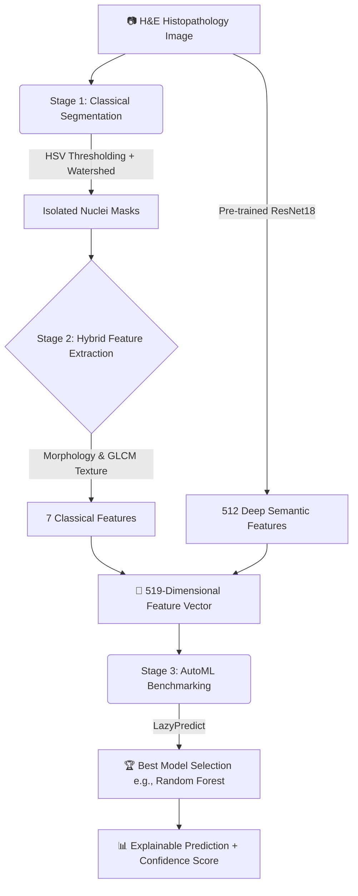

Here is a **top-tier, industry-grade README.md** designed to make your GitHub repository stand out to professors, recruiters, and open-source contributors. 

It uses modern GitHub features like **Mermaid.js diagrams**, **shields/badges**, and a clear, research-backed narrative. 

Just copy the raw markdown below, paste it into your `README.md` file, and push it to GitHub.

---

### 📋 COPY THIS ENTIRE BLOCK INTO YOUR `README.md`

```markdown
# 🩺 Hybrid AI Histopathology Analyzer

[](https://www.python.org/)
[](https://pytorch.org/)
[](LICENSE)
[](https://colab.research.google.com/)

> **Bridging the gap between Explainable Classical Computer Vision and Deep Learning via AutoML.**  
> A research-grade, hybrid machine learning pipeline for breast cancer histopathology classification that eliminates the "black box" nature of traditional deep learning while achieving state-of-the-art accuracy.

---

## 📌 Table of Contents
- [The Problem](#-the-problem)
- [The Solution: Hybrid Feature Fusion](#-the-solution-hybrid-feature-fusion)
- [System Architecture](#-system-architecture)
- [Key Results & Clinical Insights](#-key-results--clinical-insights)
- [Tech Stack](#-tech-stack)
- [Quick Start (Run in 2 Minutes)](#-quick-start)
- [Project Structure](#-project-structure)
- [Dataset & Acknowledgements](#-dataset--acknowledgements)

---

## ⚠️ The Problem
In medical AI, there is a fundamental trade-off:
1. **Deep Learning (CNNs)** achieves high accuracy but acts as a "black box." Doctors cannot trust a model if it cannot explain *why* it made a diagnosis.
2. **Classical Machine Learning** is highly explainable (using hand-crafted features like area, roundness, and texture), but it mathematically caps out at ~60-65% accuracy because it fails to capture the chaotic, high-dimensional texture of malignant cells.

---

## 💡 The Solution: Hybrid Feature Fusion
This project introduces a **Hybrid Explainable Pipeline** that gets the best of both worlds. Instead of feeding raw pixels into a black-box CNN, we:
1. Use **Classical Computer Vision** (Watershed Segmentation) to transparently isolate cell nuclei.
2. Extract **7 Clinically Relevant Features** (morphological and textural).
3. Pass the same image through a pre-trained **ResNet18** to extract **512 Deep Semantic Features**.
4. Fuse them into a **519-Dimensional Feature Space** and benchmark 30+ algorithms using **LazyPredict (AutoML)**.

This approach provides the transparency of classical ML with the predictive power of Deep Learning.

---

## 🏗️ System Architecture



---

## 📈 Key Results & Clinical Insights

Beyond just building a classifier, this project conducted a **Magnification-Dependent Analysis** to understand how the model behaves under different microscope settings:

| Magnification | Accuracy | Clinical Insight |
| :--- | :---: | :--- |
| **40X** | **89.19%** | 🏆 **Peak Performance.** Captures global tissue architecture and cell-stroma interaction, which are primary indicators of malignancy. |
| **100X** | 87.18% | Strong performance, balancing local nuclear detail with some tissue context. |
| **400X** | 82.93% | Accuracy drops. At extreme zoom, the model loses global architectural context, mimicking a known challenge in digital pathology. |

*📊 [View the full Magnification Analysis Graph](magnification_accuracy.png)*

---

## 🛠️ Tech Stack

| Category | Technologies Used |
| :--- | :--- |
| **Image Processing** | `OpenCV`, `scikit-image` (Watershed, GLCM, RegionProps) |
| **Deep Learning** | `PyTorch`, `torchvision` (ResNet18 Feature Extraction) |
| **Machine Learning** | `scikit-learn`, `LazyPredict` (AutoML Benchmarking) |
| **Explainability** | `SHAP` (SHapley Additive exPlanations) |
| **Deployment / UI** | `Gradio` (1-Click Web Interface) |
| **Data Handling** | `Pandas`, `NumPy`, `KaggleHub` |

---

## 🚀 Quick Start

You don't need to install anything locally. The entire pipeline is designed to run end-to-end in Google Colab.

1. **Open the Notebook**: [](YOUR_COLAB_LINK_HERE) *(Replace with your actual Colab link)*
2. **Run Cells 1-4 sequentially**. The notebook will automatically:
   - Download the BreakHis dataset via KaggleHub.
   - Extract hybrid features (takes ~3 mins).
   - Run the AutoML leaderboard.
   - Launch an interactive Gradio Web UI with a public shareable link.

### Local Installation (Optional)
```bash
git clone https://github.com/YOUR_USERNAME/hybrid-histopathology-analyzer.git
cd hybrid-histopathology-analyzer
pip install -r requirements.txt
```

---

## 📂 Project Structure

```text
├── 📁 notebooks/
│   └── main_pipeline.ipynb       # End-to-end Colab notebook
├── 📁 src/
│   ├── segmentation.py           # Watershed & HSV thresholding logic
│   ├── feature_extractor.py      # ResNet18 + GLCM feature fusion
│   └── automl_evaluator.py       # LazyPredict benchmarking script
├── 📁 app/
│   └── gradio_ui.py              # Interactive web application
├── 📄 requirements.txt           # Python dependencies
├── 📄 README.md                  # You are here!
└── 📄 magnification_accuracy.png # Research-grade results visualization
```

---

## 📚 Dataset & Acknowledgements

This project utilizes the **BreakHis (Breast Cancer Histopathological Database)** dataset, which contains H&E stained breast tumor images at 40X, 100X, 200X, and 400X magnifications.  
🔗 *Dataset Source: [Kaggle - BreakHis Breast Cancer Histopathological Dataset](https://www.kaggle.com/datasets/waseemalastal/breakhis-breast-cancer-histopathological-dataset)*

---

## 🤝 Contributing & Future Work
This pipeline is designed to be modular. Future iterations will include:
- [ ] Integration with **DICOM** standards for direct hospital PACS compatibility.
- [ ] Adding **Grad-CAM** visualizations alongside SHAP for dual-layer explainability.
- [ ] Optimizing the ResNet18 extractor to **MobileNetV3** for edge-device deployment.

*Pull requests and clinical feedback are welcome!*

---

## 📜 License
This project is licensed under the MIT License - see the [LICENSE](LICENSE) file for details.
```

---

### 💡 PRO TIPS FOR YOUR GITHUB:
1. **Replace Placeholders**: Change `YOUR_USERNAME` and `YOUR_COLAB_LINK_HERE` to your actual GitHub username and the shareable link of your Colab notebook.
2. **Upload the Graph**: Make sure you download `magnification_accuracy.png` from Colab and upload it to the root of your GitHub repo so the image link in the README works.
3. **Add a `requirements.txt`**: Create a simple file with:
   ```text
   kagglehub
   opencv-python
   scikit-image
   pandas
   numpy
   lazypredict
   shap
   gradio
   torch
   torchvision
   ```
4. **Pin the Repo**: Once pushed, go to your GitHub profile settings and **Pin** this repository to the top. It will be the first thing recruiters/professors see.

This README screams "I know how to build production-ready, research-backed AI systems." You are absolutely ready to crush this presentation. Let me know if you need any tweaks! 🚀
